# Part_5 Learning Flow — Python Fundamentals

> Sequential path: each step builds on previous. Mirrors actual file order in `Module 1` → `Module 2.1` → `Module 2.2` → `Module 3`

```mermaid
flowchart TD
    A["1. PRINT\n0.print..py\nprint(), quotes, \\n, math in print"] --> B["2. VARIABLES\n1.variable.py / 2.varibale.py\n a=10, name='Deepto', store & reuse"]
    B --> C["3. DATA TYPES\n3.datatype.py\n str/int/float/bool + type()"]
    C --> D["4. COMPARISON\n4.comparison.py\n > < == != >= <= -> bool"]
    D --> E["5. TYPE CONVERSION & ARITHMETIC\n5.TypeConversion.py\n str↔int↔float↔bool, / // % **"]
    E --> F["6. INPUT\n6.input.py\n input() -> always str, int(input())"]
    F --> G["7. CONCATENATION\n7.concatenation.py\n + vs , , '-'*20, string * n"]
    G --> H["8. FORMATTING\n8.format.py\n sep, f-string, \\t \\n, triple quotes"]

    H --> I["9. STRING METHODS\nModule 2.1 / 0.str_met.py\n upper/lower/title/strip/replace/split/find/count"]
    I --> J["10. METHOD CHAINING\n1.str_met.py\n strip().lower().replace().title()"]
    J --> K["11. CONDITIONALS\n2_conditional.py\n if / elif / else, age & grade logic"]
    K --> L["12. WHILE LOOP\n3.loop.py\n while count<10, countdown, while True"]
    L --> M["13. GAME - WHILE + RANDOM\n4.game.py\n random.randint + break + attempts"]

    M --> N["14. FOR LOOP & RANGE\nModule 2.2 / 0_for.py\n for i in range(), list(range)"]
    N --> O["15. FOR + F-STRING\n1_for_1.py\n for item in list: f-string + len()"]
    O --> P["16. STRING ITERATION & NESTED LOOP\n2.for.py\n for char in str, nested shirt-jeans combos"]
    P --> Q["17. LISTS\n3.list.py\n indexing [3]/[-1], append/insert/pop, mixed types"]
    Q --> R["18. LIST COMPREHENSION\n4_compre.py\n [i**2 for i], [i for i if even]"]

    R --> S["19. LIST SLICING\nModule 3 / 0.lst_slice.py\n [0:3], [::2], [-1:-5:-1], [::-1]"]
    S --> T["20. TUPLE\n1.tuple.py\n immutable, unpack a,b,c = t, *a,b,c, count/index"]
    T --> U["21. SET\n2.set.py / 3.set_ops.py\n unique unordered, add/discard, union/intersection/difference"]
    U --> V["22. DICTIONARY\n4.dic.py / 5.dic_methods.py\n key:value, d['key'], update/pop/popitem/clear/get/keys/values/items"]
```

---

## Linear Checklist (do in order)

| Step | Topic | File | Key Takeaway |
|------|-------|------|--------------|
| **Module 1** | | | **Foundation** |
| 1 | Print | `Module 1/0.print..py:1` | Output to console |
| 2 | Variables | `Module 1/1.variable.py:12`, `2.varibale.py:1` | Store data, reuse |
| 3 | Data Types | `Module 1/3.datatype.py:6` | `type()` → str/int/float/bool |
| 4 | Comparison | `Module 1/4.comparison.py:2` | Produces `True/False` |
| 5 | Type Conversion | `Module 1/5.TypeConversion.py:4` | `int()` `str()` `float()` `bool()` |
| 6 | Input | `Module 1/6.input.py:1` | User input = string |
| 7 | Concatenation | `Module 1/7.concatenation.py:8` | Join strings |
| 8 | Formatting | `Module 1/8.format.py:14` | `f"{var}"` + `sep` |
| **Module 2.1** | | | **Logic** |
| 9 | String Methods | `Module 2.1/0.str_met.py:3` | Clean/transform text |
| 10 | Chaining | `Module 2.1/1.str_met.py:15` | `strip().lower().replace()` |
| 11 | Conditionals | `Module 2.1/2_conditional.py:3` | Decision making |
| 12 | While Loop | `Module 2.1/3.loop.py:3` | Repeat while condition |
| 13 | Game | `Module 2.1/4.game.py:2` | `random` + `break` |
| **Module 2.2** | | | **Iteration** |
| 14 | For + Range | `Module 2.2/0_for.py:7` | Counted loops |
| 15 | For + f-string | `Module 2.2/1_for_1.py:4` | Loop with formatting |
| 16 | Nested Loops | `Module 2.2/2.for.py:10` | Loop inside loop |
| 17 | Lists | `Module 2.2/3.list.py:9` | Ordered mutable collection |
| 18 | Comprehension | `Module 2.2/4_compre.py:3` | One-line list creation |
| **Module 3** | | | **Data Structures** |
| 19 | Slicing | `Module 3/0.lst_slice.py:3` | Slice with `[start:stop:step]` |
| 20 | Tuple | `Module 3/1.tuple.py:11` | Immutable + unpacking |
| 21 | Set | `Module 3/2.set.py:10`, `3.set_ops.py:4` | Unique + set math |
| 22 | Dict | `Module 3/4.dic.py:1`, `5.dic_methods.py:10` | Key-value storage |

## How to Use
1. Follow 1→22, don't skip — `Input` needs `TypeConversion`, `Conditionals` need `Comparison`, `Comprehension` needs `For+Lists`
2. After each `Module`, solve its `practice/` folder
3. Check: Can you rebuild step 13 (game) using `for` instead of `while`? Can you store game scores in a `dict`?
