# Python Bootcamp Learning Flow — Comprehensive Guide

> Sequential path: each step builds on the previous one. Mirrors the actual file structure across `Module 1` → `Module 2.1` → `Module 2.2` → `Module 3.1` → `Module 3.2` → `Module 4.1` → `Module 4.2`.

```mermaid
flowchart TD
    subgraph M1["Module 1: Foundations"]
        A["1. PRINT\n0.print..py\nprint(), quotes, \\n, math in print"] --> B["2. VARIABLES\n1.variable.py / 2.varibale.py\nStore & reuse values"]
        B --> C["3. DATA TYPES\n3.datatype.py\nstr/int/float/bool + type()"]
        C --> D["4. COMPARISON\n4.comparison.py\n> < == != >= <= -> bool"]
        D --> E["5. TYPE CONVERSION & MATH\n5.TypeConversion.py\nstr↔int↔float↔bool, / // % **"]
        E --> F["6. INPUT\n6.input.py\ninput() -> always str, int(input())"]
        F --> G["7. CONCATENATION\n7.concatenation.py\n+ vs , , '-'*20, string * n"]
        G --> H["8. FORMATTING\n8.format.py\nsep, f-string, \\t \\n, multiline"]
    end

    subgraph M2_1["Module 2.1: Strings & Control Flow"]
        H --> I["9. STRING METHODS\n0.str_met.py\nupper/lower/title/strip/replace/split/find/count"]
        I --> J["10. METHOD CHAINING\n1.str_met.py\nstrip().lower().replace().title()"]
        J --> K["11. CONDITIONALS\n2_conditional.py\nif / elif / else, branching logic"]
        K --> L["12. WHILE LOOP\n3.loop.py\nwhile count<10, countdown, while True"]
        L --> M["13. GAME (WHILE + RANDOM)\n4.game.py\nrandom.randint + break + attempts"]
    end

    subgraph M2_2["Module 2.2: Loops & Sequences"]
        M --> N["14. FOR LOOP & RANGE\n0_for.py\nrange(start, stop, step), list(range)"]
        N --> O["15. FOR + F-STRING\n1_for_1.py\nfor item in list: f-string + len()"]
        O --> P["16. STRING ITERATION & NESTED LOOPS\n2.for.py\nfor char in str, nested combinations"]
        P --> Q["17. LISTS\n3.list.py\nindexing [3]/[-1], append/insert/pop, mixed types"]
        Q --> R["18. LIST COMPREHENSION\n4_compre.py\n[i**2 for i in list], [i for i if even]"]
    end

    subgraph M3_1["Module 3.1: Core Data Structures"]
        R --> S["19. LIST SLICING\n0.lst_slice.py\n[0:3], [::2], [-1:-5:-1], [::-1] reverse"]
        S --> T["20. TUPLE\n1.tuple.py\nimmutable, unpack a,b,c = t, *a,b"]
        T --> U["21. SET & SET OPERATIONS\n2.set.py / 3.set_ops.py\nunique unordered, add/discard, union/intersection/difference"]
        U --> V["22. DICTIONARY\n4.dic.py / 5.dic_methods.py\nkey:value, get/update/pop/popitem/items/keys/values"]
    end

    subgraph M3_2["Module 3.2: Advanced Iteration & Comprehensions"]
        V --> W["23. ADVANCED ITERATION\n0.lst.py / 1.dic.py\niterating collections, dict.items() unpacking"]
        W --> X["24. COMPREHENSIONS (SET/TUPLE/DICT)\n2compre.py\nset & dict comprehensions, condition filters"]
        X --> Y["25. NESTED STRUCTURES\n3.nested.py\ndeep indexing into nested lists & dicts"]
        Y --> Z["26. ENUMERATE & ZIP\n4.enumerate.py / 5.zip.py\nindex tracking enumerate(), parallel loops zip()"]
    end

    subgraph M4_1["Module 4.1: Functions & Error Handling"]
        Z --> AA["27. FUNCTION BASICS\n0.func.py / 1.func.py\ndef, parameters, default arguments"]
        AA --> AB["28. RETURN VALUES & TUPLE RETURNS\n2.func.py / 3.func.py / 4.func.py\nreturn vs print, multiple return values"]
        AB --> AC["29. EXCEPTION HANDLING\n5.func.py / 6.func.py\ntry/except, ZeroDivisionError, TypeError"]
        AC --> AD["30. MODULES & UTILITIES\n7.func.py\ndatetime, strftime, random"]
    end

    subgraph M4_2["Module 4.2: File Handling & OOP"]
        AD --> AE["31. FILE I/O\n0.mount.py\nopen (w, r, a), with open() context manager"]
        AE --> AF["32. OOP BASICS & CONSTRUCTORS\n1.class.py / OOP/0.oop.py / OOP/1.oop.py\nclass, object, __init__, self, instance methods"]
        AF --> AG["33. STATIC METHODS & ENCAPSULATION\nOOP/2.oop.py / OOP/4.oop.py / OOP/7.oop.py / 3.class.py\n@staticmethod, private members (__balance), ATM & Bank design"]
        AG --> AH["34. DOMAIN CLASSES & INHERITANCE\nOOP/5.oop.py / OOP/8.oop.py\nShoppingCart project, class inheritance (Base -> Child)"]
    end
```

---

## Linear Checklist (Do in Order)

| Step | Topic | File | Key Takeaway |
|:---:|:---|:---|:---|
| **Module 1** | | | **Foundation** |
| 1 | Print | `Module 1/0.print..py` | Output to console, quotation rules, math expressions |
| 2 | Variables | `Module 1/1.variable.py`, `2.varibale.py` | Store and reuse data in memory |
| 3 | Data Types | `Module 1/3.datatype.py` | `type()` inspection → `str`, `int`, `float`, `bool` |
| 4 | Comparison | `Module 1/4.comparison.py` | Comparison operators producing boolean results (`==`, `!=`, `<`, `>`) |
| 5 | Type Conversion | `Module 1/5.TypeConversion.py` | Explicit casting (`int()`, `float()`, `str()`) & arithmetic (`//`, `%`, `**`) |
| 6 | Input | `Module 1/6.input.py` | User input is always `str`; cast with `int(input())` |
| 7 | Concatenation | `Module 1/7.concatenation.py` | String joining with `+` vs `,`, string multiplication (`'-'*20`) |
| 8 | Formatting | `Module 1/8.format.py` | `f"{var}"`, separator control `sep=`, multiline strings |
| **Module 2.1** | | | **Logic & Control Flow** |
| 9 | String Methods | `Module 2.1/0.str_met.py` | Clean/transform text (`upper`, `lower`, `title`, `strip`, `replace`, `split`, `find`, `count`) |
| 10 | Chaining | `Module 2.1/1.str_met.py` | Fluent method chaining (`strip().lower().replace()`) |
| 11 | Conditionals | `Module 2.1/2_conditional.py` | `if`, `elif`, `else` branching decision trees |
| 12 | While Loop | `Module 2.1/3.loop.py` | Repeat execution while condition holds; loop counters |
| 13 | Game | `Module 2.1/4.game.py` | Interactive guessing game with `random.randint`, `break`, attempt tracking |
| **Module 2.2** | | | **Iteration & Lists** |
| 14 | For + Range | `Module 2.2/0_for.py` | Counted iterations using `range(start, stop, step)` |
| 15 | For + f-string | `Module 2.2/1_for_1.py` | Looping through collections, formatting items, `len()` |
| 16 | Nested Loops | `Module 2.2/2.for.py` | Iterating strings and nested loop combinations (Cartesian products) |
| 17 | Lists | `Module 2.2/3.list.py` | Ordered mutable collections, indexing, `append()`, `insert()`, `pop()` |
| 18 | Comprehension | `Module 2.2/4_compre.py` | Concise one-line list creation and filtering |
| **Module 3.1** | | | **Core Data Structures** |
| 19 | Slicing | `Module 3.1/0.lst_slice.py` | Extracting sub-lists with `[start:stop:step]`, reversing `[::-1]` |
| 20 | Tuple | `Module 3.1/1.tuple.py` | Immutable sequences, tuple unpacking (`a, b = t`) and starred unpack (`*a, b = t`) |
| 21 | Set | `Module 3.1/2.set.py`, `3.set_ops.py` | Unordered unique elements, `add()`, `discard()`, `union()`, `intersection()`, `difference()` |
| 22 | Dict | `Module 3.1/4.dic.py`, `5.dic_methods.py` | Key-value pairs, `get()`, `update()`, `pop()`, `popitem()`, `clear()`, `items()`, `keys()`, `values()` |
| **Module 3.2** | | | **Advanced Iteration & Comprehensions** |
| 23 | Collection Iteration | `Module 3.2/0.lst.py`, `1.dic.py` | Iterating lists, tuples, sets; unpacking `for name, roll in students.items()` |
| 24 | Advanced Comprehensions | `Module 3.2/2compre.py` | Set comprehensions, tuple generators, and dictionary comprehensions with filters |
| 25 | Nested Structures | `Module 3.2/3.nested.py` | Multilevel navigation inside complex nested lists and dictionaries |
| 26 | Enumerate & Zip | `Module 3.2/4.enumerate.py`, `5.zip.py` | `enumerate()` for indexed iteration; `zip()` for parallel looping over multiple iterables |
| **Module 4.1** | | | **Functions & Error Handling** |
| 27 | Function Basics | `Module 4.1/0.func.py`, `1.func.py` | Function definition `def`, positional arguments, default parameters (`name="Guest"`) |
| 28 | Return & Multi-Values | `Module 4.1/2.func.py` - `4.func.py` | `return` vs `print`, keyword arguments, returning multiple values as a tuple |
| 29 | Exception Handling | `Module 4.1/5.func.py`, `6.func.py` | `try ... except` blocks, catching specific errors (`ZeroDivisionError`, `TypeError`) |
| 30 | Standard Modules | `Module 4.1/7.func.py` | Working with `datetime` formatting (`strftime`) and `random` |
| **Module 4.2** | | | **File Handling & Object-Oriented Programming (OOP)** |
| 31 | File Handling | `Module 4.2/0.mount.py` | Reading (`r`), writing (`w`), appending (`a`), and safe resource handling with `with open(...)` |
| 32 | Classes & Constructors | `Module 4.2/1.class.py`, `OOP/0.oop.py`, `OOP/1.oop.py` | Class definition, object instances, `__init__` constructor, `self`, instance methods |
| 33 | Methods & Encapsulation | `Module 4.2/OOP/2.oop.py`, `OOP/4.oop.py`, `OOP/7.oop.py`, `3.class.py` | `@staticmethod`, private attributes (`__balance`), ATM & Banking system design |
| 34 | Domain Modeling & Inheritance | `Module 4.2/OOP/5.oop.py`, `OOP/8.oop.py` | Complete domain modeling (`ShoppingCart`) and single inheritance (`class Toyota(Car)`) |

---

## Practice Track by Module

After completing the theory and demonstration files of each module, complete its corresponding practice problems:

- **Module 1 Practice**: `Module 1/practice/` — 4 scripts covering printing, variables, data types, and input/formatting.
- **Module 2.1 Practice**: `Module 2.1/practice/` — 4 scripts covering string methods, conditionals, loops, and guessing games.
- **Module 2.2 Practice**: `Module 2.2/Practice/` — Problem questions and solution reference for loops and comprehensions.
- **Module 3.1 Practice**: `Module 3.1/practice/` — 3 scripts covering basic dictionary operations, dictionary manipulation, and dictionary views.
- **Module 3.2 Practice**: `Module 3.2/practice/` — 6 structured problems (`1_unique_iteration.py` through `6_zip_receipt.py`) with a full guide in `README.md`.
- **Module 4.1 Practice**: `Module 4.1/practice/` — 4 scripts practicing greet functions, pass/fail checkers, item search, and grade summaries.
- **Module 4.2 OOP Practice**: `Module 4.2/OOP/` — Progressive OOP programs (student marks, bank debit/credit, shopping cart discounts, private members, inheritance).

---

## How to Use
1. **Follow 1 → 34 sequentially**: Never skip steps — Functions depend on loops/conditionals, File I/O requires string/path handling, and OOP builds on functions and data structures.
2. **Solve practice files after each module**: Test your knowledge immediately in the respective `practice/` folder.
3. **Capstone Synthesis**: Challenge yourself to build a full project combining:
   - File I/O (reading/saving records)
   - OOP classes with private attributes and methods
   - Functions with robust error handling (`try/except`)
   - Advanced comprehensions, `enumerate()`, and `zip()`

